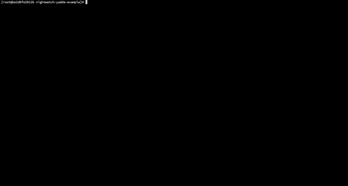

# Nightwatch.js + Yadda example
An example template on how to combine [Nightwatch.js](http://nightwatchjs.org) and [Yadda](https://github.com/acuminous/yadda#yadda) (in a [Selenium Docker container](https://github.com/SeleniumHQ/docker-selenium#selenium-docker)).

## Install
### Mac

```sh
brew install node docker boot2docker

npm install -g nightwatch
npm install

boot2docker init && boot2docker up
docker run -d -p 4444:4444 selenium/standalone-chrome:2.46.0
```
## Running
```sh
nightwatch
```


